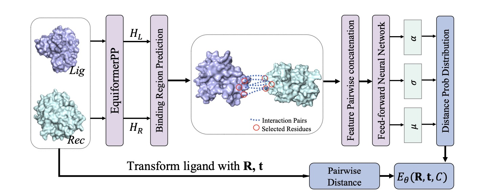

# EBMDock: Neural Probabilistic Protein-Protein Docking via a Differentiable Energy Model

Official implementation for the paper "EBMDOCK: NEURAL PROBABILISTIC PROTEIN-PROTEIN DOCKING VIA A DIFFERENTIABLE ENERGY-BASED MODEL" (ICLR 2024).  https://openreview.net/pdf?id=qg2boc2AwU



## Dependencies

This work was developed and tested under pytorch 1.12.1 with CUDA 11.6. Please install main dependencies as follows:

```

conda create -n dock python=3.9
conda activate dock

conda install pytorch==1.12.1 torchvision==0.13.1 torchaudio==0.12.1 cudatoolkit=11.6 -c pytorch -c conda-forge
conda install pyg -c pyg


pip install pyg_lib torch_scatter torch_sparse torch_cluster torch_spline_conv torch_geometric -f https://data.pyg.org/whl/torch-1.12.1+cu116.html

pip install pandas biopandas dill biopandas e3nn biopython==1.80 horovod[pytorch]==0.27.0 
pip install networkx==2.6.3 dgl==1.1.3 dglgo==0.0.2 dgllife==0.3.2


```

## Data

### DB5.5

We have provided raw data in data/DB5/structures.

### Antibody-antigen

We follow ''trimodock: Rigid protein docking via cross-modal representation learning and spectral algorithm'' and select 68 antibody-antigen samples from the Protein Data Bank which were released after October 2022.

We have provided the raw data in data/antibody-antigen.

### DIPS-Het

We use DIPS-Het to train our model. Input data to this dataset generation pipeline can be downloaded from the RCSB database, further steps please refer to data/DIPS-Het

## Reproducibility

1. You can train an energy model by running:

```

python train.py -ebm_train -n_gaussians 6 -dataset dipshet -data_path ./data/DIPS-Het

```

Use -ebm_train is a little bit time consuming, you can also use -ll_train instead (which directly maximize the log_likelihood of distances).

3. You can train an interface prediction model by running:

```

python train.py -cp -dataset dipshet -data_path ./data/DIPS-Het


```

3. You can also train 1,2 at the same time by running:
   ```
   python train.py -cp -dataset dipshet -data_path ./data/DIPS-Het -ebm_train -n_gaussians 6
   ```
4. We have provided the pretrained model in `checkpoints/`, you can evaluate a trained model by running:

```

python evaluate.py -dataset db5 -data_path ./data/DB5 -intersection_loss -known_interface

```

Here -known_interface means when we have a rough knowledge of the interaction interface. You can also use the trained model to predict the interaction interface (just remove -knwon_interface).

5. You can predict the docking pose of any two proteins by running:

```

python inference.py -receptor_file_path [your receptor file path] -ligand_file_path [your ligand file path] -output_ligand_path  [the output ligand file path] 

```

This will generate the predicted ligand pose and the result pdb will be saved in -output_ligand_path.

## Citation

@inproceedings{wu2023neural,

  title={EBMDock: Neural Probabilistic Protein-Protein Docking via a Differentiable Energy Model},

  author={Wu, Huaijin and Liu, Wei and Bian, Yatao and Wu, Jiaxiang and Yang, Nianzu and Yan, Junchi},

  booktitle={The Twelfth International Conference on Learning Representations},

  year={2024}

}

## Acknowledgement

We appreciate the following works for their valuable code and data:

https://github.com/octavian-ganea/equidock_public

https://github.com/bytedance/HMR

https://github.com/atomicarchitects/equiformer
